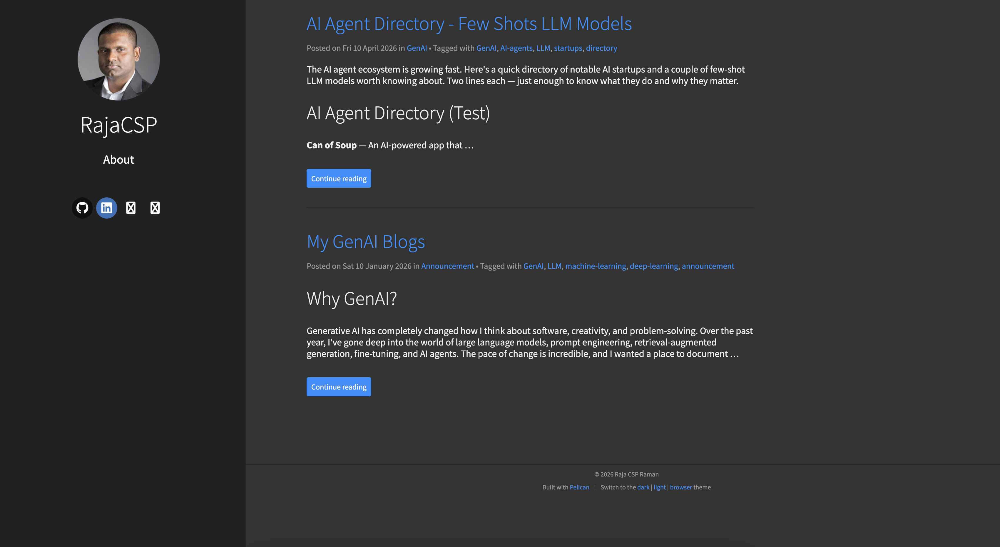

# rajacsp.github.io

Personal blog built with [Pelican](https://getpelican.com/) and deployed to GitHub Pages via GitHub Actions.

🔗 **Live site:** [https://rajacsp.github.io](https://rajacsp.github.io)

## Setup

```bash
pip install -r requirements.txt
```

## Local Development

```bash
make devserver
```

Serves the site locally with auto-reload.

## Build for Production

```bash
make publish
```

Generates the site using `publishconf.py` into the `output/` directory.

## Deployment

Pushes to `main` automatically trigger a GitHub Actions workflow that builds and deploys the site to GitHub Pages.

## Project Structure

```
content/          # Blog posts and pages (Markdown)
content/images/   # Static images
content/pages/    # Static pages (e.g., About)
theme/            # Custom Pelican theme (Flex-based)
pelicanconf.py    # Development config
publishconf.py    # Production config
```


## Screenshots
